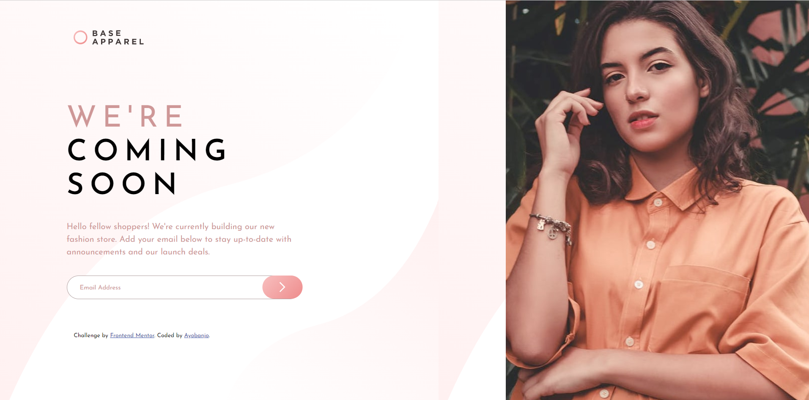
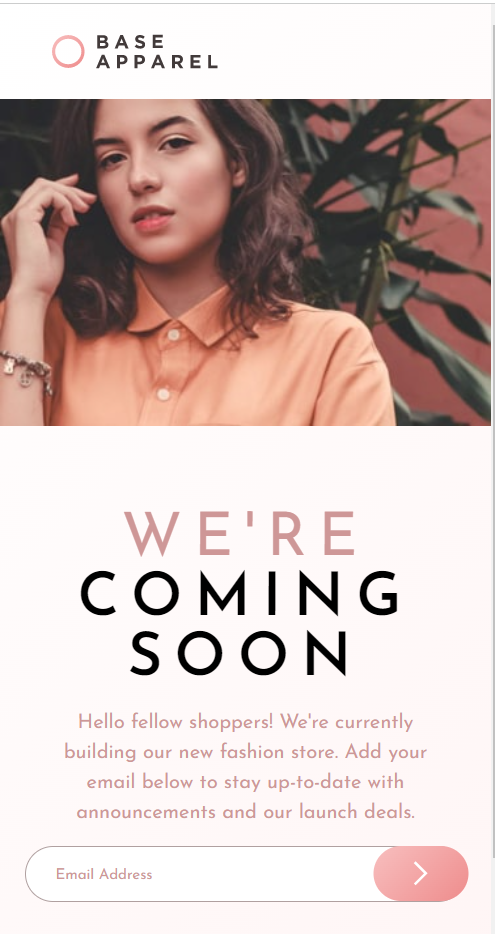

# Frontend Mentor - Base Apparel coming soon page solution

This is a solution to the [Base Apparel coming soon page challenge on Frontend Mentor](https://www.frontendmentor.io/challenges/base-apparel-coming-soon-page-5d46b47f8db8a7063f9331a0). Frontend Mentor challenges help you improve your coding skills by building realistic projects.

## Table of contents

- [Overview](#overview)
  - [The challenge](#the-challenge)
  - [Screenshot](#screenshot)
  - [Links](#links)
- [My process](#my-process)
  - [Built with](#built-with)
  - [What I learned](#what-i-learned)
  - [Continued development](#continued-development)
  - [Useful resources](#useful-resources)
- [Author](#author)
- [Acknowledgments](#acknowledgments)

## Overview

Designed a Base Apparel coming soon Page

### The challenge

The challenge is to build out this Base Apparel coming soon Page and get it looking as close to the design provided by Frontend Mentor as possible.
Users should be able to:

- View the optimal layout for the site depending on their device's screen size
- See hover and active states for all interactive elements on the page
- Receive an error message when the `form` is submitted if:
  - The `input` field is empty
  - The email address is not formatted correctly

### Screenshot

### Links

- Solution URL: [Add solution URL here](https://github.com/ayobanjo/frontend_mentor-3)
- Live Site URL: [Add live site URL here](https://ayobanjo.github.io/frontend_mentor-3/)

## My process

I started to build with a mobile first approach, which was good and easy, as elements where placed in block form. Switching to the desktop view was quite complicated with many ideas coming through on how to implement the design.

I opted in to use CSS Grid, which is do not have lots of experience using, but it was the most elegant solution. Check outcome in - (`### Screenshot`)

### Built with

- Semantic HTML5 markup
- CSS custom properties
- Flexbox
- CSS Grid
- Mobile-first workflow

### What I learned

I strengthened my understanding of CSS grid through its application in this project. I also learnt simple form validation, which still needs lots of work though.
I also learnt how to place a button and an inout field together

### Continued development

- CSS Grid
- Form Validation usinf JavaScript

### Useful resources

- [FreeCode Camp](https://www.freecodecamp.org/news/form-validation-with-html5-and-javascript/) - This helped me for form validation.
- [geeksforgeeks](https://www.geeksforgeeks.org/how-to-put-a-responsive-clear-button-inside-html-input-text-field/) - This helped in placing the input field and button together

## Author

- GitHub - [Funsho Ayobanjo](https://github.com/ayobanjo)
- Frontend Mentor - [@ayobanjo](https://www.frontendmentor.io/profile/ayobanjo)
- Twitter - [@AyobanjoFunsho](https://www.twitter.com/ayobanjofunsho)

## Acknowledgments

My acknowledgments goes to FrontEnd mentor for the platform provided to hone my skills
